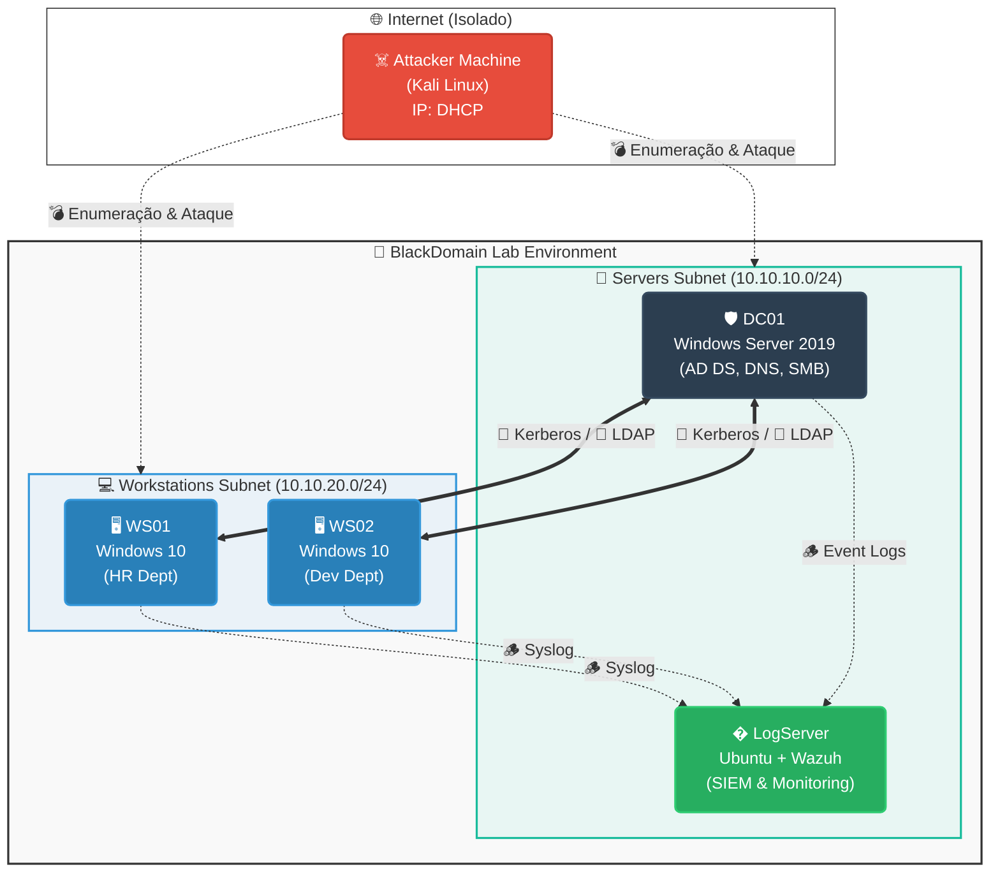
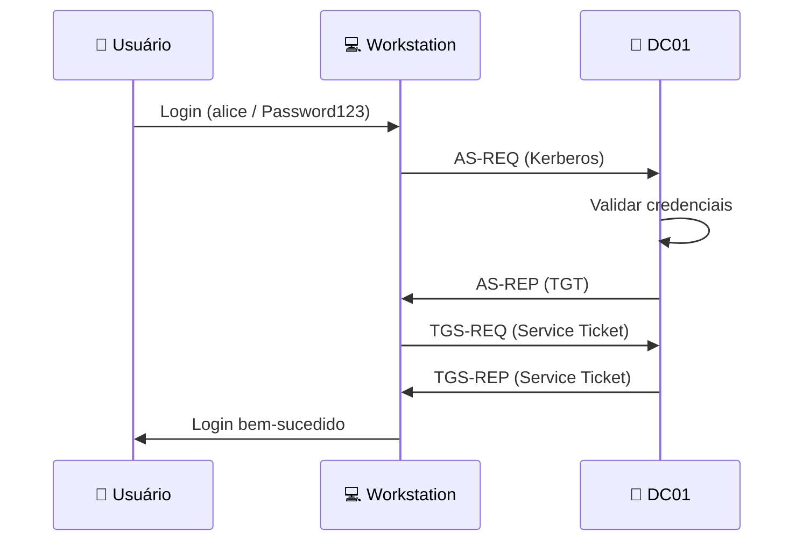
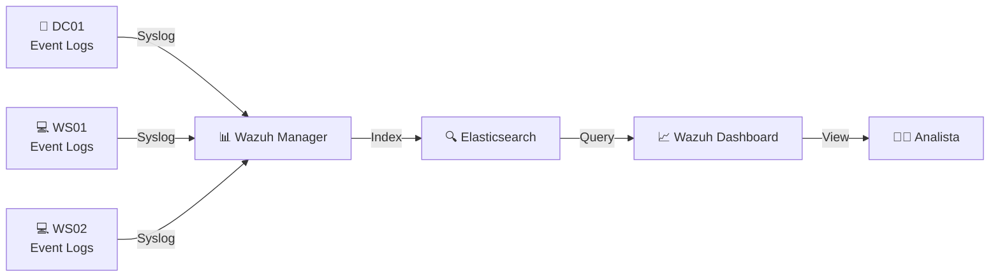

# 🌐 Topologia de Rede - BlackDomain

## Diagrama de Rede



---

## 📊 Tabela de Hosts

| Hostname | IP | OS | Função | Serviços | RAM | CPU |
|----------|----|----|--------|----------|-----|-----|
| **DC01** | 10.10.10.10 | Windows Server 2019 | Domain Controller | AD DS, DNS, SMB | 2GB | 2 |
| **WS01** | 10.10.20.11 | Windows 10 | Workstation | IIS, WinRM | 2GB | 2 |
| **WS02** | 10.10.20.12 | Windows 10 | Workstation | SQL Express (sim), WinRM | 2GB | 2 |
| **LogServer** | 10.10.10.20 | Ubuntu 22.04 | SIEM | Wazuh, Docker | 1GB | 2 |

**Total de Recursos**: 7GB RAM, 8 CPUs

---

## 🔌 Portas e Serviços

### DC01 (10.10.10.10)

| Porta | Protocolo | Serviço | Descrição |
|-------|-----------|---------|-----------|
| 53 | TCP/UDP | DNS | Domain Name System |
| 88 | TCP/UDP | Kerberos | Autenticação |
| 135 | TCP | RPC | Remote Procedure Call |
| 139 | TCP | NetBIOS | NetBIOS Session Service |
| 389 | TCP/UDP | LDAP | Lightweight Directory Access Protocol |
| 445 | TCP | SMB | Server Message Block |
| 464 | TCP/UDP | Kerberos | Kerberos Password Change |
| 636 | TCP | LDAPS | LDAP over SSL |
| 3268 | TCP | Global Catalog | GC LDAP |
| 3269 | TCP | Global Catalog SSL | GC LDAPS |
| 3389 | TCP | RDP | Remote Desktop |
| 5985 | TCP | WinRM HTTP | Windows Remote Management |
| 5986 | TCP | WinRM HTTPS | Windows Remote Management SSL |

### WS01 (10.10.20.11)

| Porta | Protocolo | Serviço | Descrição |
|-------|-----------|---------|-----------|
| 80 | TCP | HTTP | IIS Web Server |
| 135 | TCP | RPC | Remote Procedure Call |
| 139 | TCP | NetBIOS | NetBIOS Session Service |
| 445 | TCP | SMB | Server Message Block |
| 3389 | TCP | RDP | Remote Desktop |
| 5985 | TCP | WinRM HTTP | Windows Remote Management |

### WS02 (10.10.20.12)

| Porta | Protocolo | Serviço | Descrição |
|-------|-----------|---------|-----------|
| 135 | TCP | RPC | Remote Procedure Call |
| 139 | TCP | NetBIOS | NetBIOS Session Service |
| 445 | TCP | SMB | Server Message Block |
| 1433 | TCP | MSSQL | SQL Server (simulado) |
| 3389 | TCP | RDP | Remote Desktop |
| 5985 | TCP | WinRM HTTP | Windows Remote Management |

### LogServer (10.10.10.20)

| Porta | Protocolo | Serviço | Descrição |
|-------|-----------|---------|-----------|
| 22 | TCP | SSH | Secure Shell |
| 443 | TCP | HTTPS | Wazuh Dashboard |
| 1514 | TCP | Wazuh Agent | Agent Communication |
| 1515 | TCP | Wazuh Enrollment | Agent Enrollment |
| 55000 | TCP | Wazuh API | REST API |

---

## 🔐 Fluxo de Autenticação



---

## 📡 Fluxo de Logs



---

## 🎯 Vetores de Ataque

### 1. Enumeração Externa
```
Atacante → DC01:389 (LDAP)
Atacante → DC01:445 (SMB)
```

### 2. Autenticação Inicial
```
Atacante → DC01:88 (Kerberos)
Atacante → DC01:445 (SMB Auth)
```

### 3. Lateral Movement
```
WS01 → WS02:445 (SMB)
WS01 → WS02:5985 (WinRM)
WS01 → DC01:445 (SMB)
```

### 4. Exfiltração de Dados
```
DC01:445 → Atacante (SMB Download)
WS01:80 → Atacante (HTTP)
```

---

## 🛡️ Segmentação de Rede

### Servers Subnet (10.10.10.0/24)
- **Propósito**: Infraestrutura crítica
- **Hosts**: DC01, LogServer
- **Acesso**: Restrito (em produção)

### Workstations Subnet (10.10.20.0/24)
- **Propósito**: Estações de trabalho
- **Hosts**: WS01, WS02
- **Acesso**: Usuários do domínio

### Isolamento
- ❌ **Sem firewall** entre subnets (vulnerável)
- ❌ **Sem VLAN** segregation
- ❌ **Sem IDS/IPS**
- ✅ **Isolado da internet** (ambiente de lab)

---

## 📋 Configuração de DNS

### Zona: blackdomain.local

| Registro | Tipo | Valor |
|----------|------|-------|
| @ | SOA | dc01.blackdomain.local |
| @ | NS | dc01.blackdomain.local |
| dc01 | A | 10.10.10.10 |
| ws01 | A | 10.10.20.11 |
| ws02 | A | 10.10.20.12 |
| logsrv | A | 10.10.10.20 |
| _ldap._tcp | SRV | dc01.blackdomain.local:389 |
| _kerberos._tcp | SRV | dc01.blackdomain.local:88 |
| _kerberos._udp | SRV | dc01.blackdomain.local:88 |

---

## 🔄 Comunicação entre Hosts

### DC01 ↔ Workstations
- **Kerberos**: Autenticação
- **LDAP**: Queries do AD
- **DNS**: Resolução de nomes
- **SMB**: Group Policy, SYSVOL
- **RPC**: Gerenciamento remoto

### Workstations ↔ LogServer
- **Syslog**: Envio de logs
- **HTTPS**: Acesso ao dashboard (opcional)

### DC01 ↔ LogServer
- **Syslog**: Envio de logs do DC
- **SSH**: Administração (se necessário)

---

## 🚨 Monitoramento

### Eventos Capturados pelo Wazuh

| Fonte | Eventos Monitorados |
|-------|---------------------|
| **DC01** | Logons, Falhas de autenticação, Criação de usuários, Mudanças em GPO |
| **WS01** | Logons, Execução de processos, Acesso a arquivos, Comandos PowerShell |
| **WS02** | Logons, Execução de processos, Acesso a arquivos, Comandos PowerShell |

### Alertas Configurados
- ✅ Múltiplas falhas de autenticação (Password Spraying)
- ✅ Kerberoasting detectado
- ✅ Uso de ferramentas de pentest (Mimikatz, BloodHound)
- ✅ Lateral movement suspeito
- ✅ Acesso a compartilhamentos sensíveis

---

## 📝 Notas de Configuração

### Vagrant Networking
```ruby
# Rede privada isolada
config.vm.network "private_network", ip: "10.10.10.10"
```

### VirtualBox Network Adapter
- **Adapter 1**: NAT (para download de boxes)
- **Adapter 2**: Host-Only (10.10.10.0/24 e 10.10.20.0/24)

### Conectividade do Atacante
Para atacar o ambiente, configure sua máquina Kali/Parrot com IP na mesma rede:
```bash
# Exemplo: Configurar IP estático
sudo ip addr add 10.10.10.100/24 dev eth1
sudo ip route add 10.10.20.0/24 via 10.10.10.10
```

---

**Ambiente isolado e seguro para treinamento! 🎓🔒**
